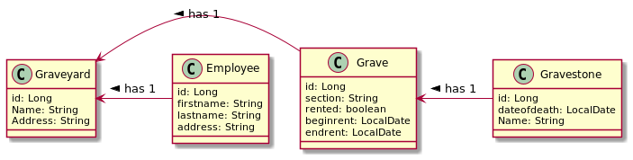
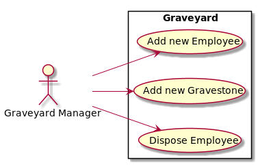

# graveyard project

#Use Case Description
Use Case 1: Add new Employee
Die Festanstellung eines neuen Mitarbeiters

Use Case 2: Add new Gravestone
Die Hinzufügung eines Grabsteines zu einem Grab

Use Case 3: Dispose Employee
Die Kündigung eines Mitarbeiters